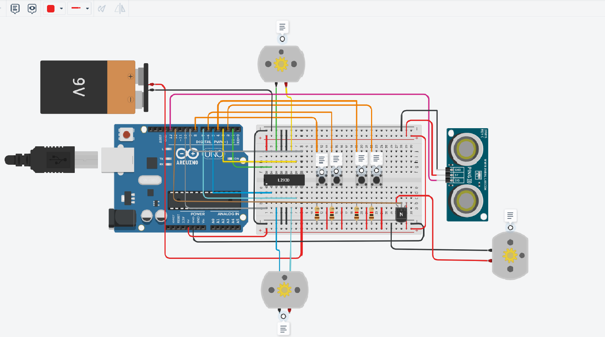

# combatRobot
Desenvolvimento de um sistema robótico de um robô de combate  com arduino no Tinkercad.

# circuito do sistema robótico

Sistema robótico de um carro de combate equipado com três motores distintos: um para controlar as rodas esquerdas, outro para as rodas direitas e um terceiro motor que opera a arma do robô que podemos considerar uma serra, por exemplo. Este projeto emprega um sensor ultrassônico para determinar a distância entre o robô e um potencial inimigo. Quando a distância atinge um valor predeterminado, conforme estabelecido no código, o sistema é acionado, iniciando a operação da serra como uma medida defensiva.